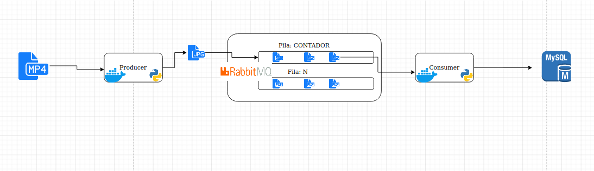

# Streaming-com-RabbitMQ-
Aqui vamos montar nosso sistema de mensageria para streaming com RabbitMQ

#### Arquitetura 



##### requisitos 

* docker-ce  

#### instalando ambiente docker do rabbitMQ
```console

foo@bar:~ $ sudo docker run -d --hostname my-rabbit --name some-rabbit -p 8081:15672 -p 5672:5672 -p 25676:25676 rabbitmq:3-management      

```

#### Crie ambiente python e instale as bibliotecas
```console

foo@bar:~ $ cd producer/

foo@bar:~ producer $ make deploy-prod
.... CRIANDO APP e SUBINDO

```
---
#### Em seguida abra o terminal separadamente RODE O PRODUCER
```console
foo@bar:~ $ cd consumer/make deploy-prod
foo@bar:~ consumer $ 

```


#### DEMO 


LINK - https://www.youtube.com/watch?v=DzO9vV2RBmI
